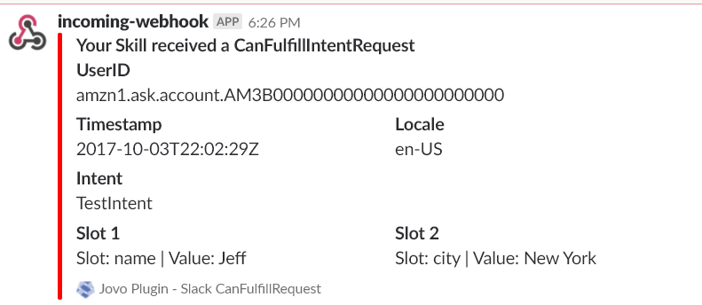

Logs data about incoming Alexa `Canfulfill` requests on Slack

> If you are using the Jovo Framework version < 2.0.0, please checkout the v1 branch [here](https://github.com/KaanKC/jovo-plugin-canfulfill-slack/tree/v1)

# Installation
```sh
$ npm install jovo-plugin-canfulfill-slack --save
```

In your Jovo project:
```javascript
const {SlackCanfulfillPlugin} = require('jovo-plugin-canfulfill-slack');

const app = new App();

app.use(
    // other plugins, platforms, etc.
    new SlackCanfulfillPlugin()
);
```

To create enable incoming webhooks for your Slack follow this [guide](https://api.slack.com/incoming-webhooks).

# Customize
NOTE: The webhookUrl is a **required** parameter

The plugin sends the error message as an [attachement](https://api.slack.com/docs/message-attachments). Every parameter is customizable except the `ts` parameter.

You can use the `config.js` file to add the changes in the following format:

```javascript
module.exports = {
    // other configurations
    plugin: {
        SlackCanfulfillPlugin: {
            webhookUrl: '',
            channel: '',
            fallback: '',
            color: '',
            pretext: '', 
            author_name: '',
            author_link: '',
            author_icon: '',
            title: '',
            title_link: '',
            text: '',
            image_url: '',
            thumb_url: '',
            footer: '',
            footer_icon: '',
        },
        // other plugins
    }
};
```

If you don't customize anything, these default values will be used:

```javascript
module.exports = {
    plugin: {
        SlackCanfulfillPlugin: {
            channel: 'Channel you specified in your webhook\'s settings',
            fallback: 'CanFulfillIntentRequest',
            color: '#ff0000',
            title: 'You received a CanFulfillIntentRequest!',
            footer: 'Jovo Plugin - Slack CanFulfillRequest',
            footer_icon: jovoLogo
        },
    }
};
```

Checkout the official documentation for more information on each parameter: [Docs](https://api.slack.com/docs/message-attachments)

You can also override the channel/user the message should be sent to: 

```javascript
module.exports = {
    plugin: {
        SlackCanfulfillPlugin: {
            channel: '#channel-name / @user-name',
        },
    }
};
```



# License

MIT